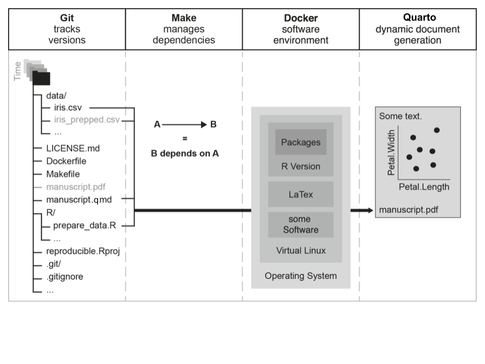

### Dynamic reporting solves copy-paste problem, but ...

::: incremental
- How to keep track of different **file versions**?
  * `paper-final.qmd` → `paper-final2.qmd` → `paper-final2b.qmd`
  + Solution: **Git**

- How to know which files to run in which **order**?
  * `functions.qmd`, `analysis.qmd`, `plots.qmd`, `paper.qmd`
  + Solution: **Make**

- How to make sure code still runs when **software versions** change?
  * `Today`: R version 4.5, ggplot2 3.5.2 → `Next year`: R version ?, ggplot2 ?
  + Solution: **Docker**

:::

------------------------------------------------------------------------

## Goals

* Computational reproducibility is a spectrum

* Understanding what is possible towards the right side

* ~~Deep technical understanding of advanced reproducible workflows~~

------------------------------------------------------------------------

## Version control with Git


:::: {.columns}

::: {.column width="75%"}
- Can **go back in time** to previous versions

- Can **track changes** between versions

- Also useful for **collaboration** and **file transfer**

- **Command line** interface

- **Graphical interface** in many editors/IDEs (e.g., RStudio, VS Code)

- **Git** (software) ≠ **GitHub**/**GitLab** (Git repository hosting services)

- Snapshots enable **persistently archiving** (with DOI) on data repositories (e.g., Zenodo)

<!-- - Git repository: directory with `.git/` subdirectory -->

:::

::: {.column width="25%"}
![[<https://git-scm.com/downloads/logos>]{style="font-size:0.7em"}](img/Git-logo.png)

![[<https://commons.wikimedia.org/wiki/File:Git_operations.svg>]{style="font-size:0.7em"}](img/Git_operations.png)
:::

::::


------------------------------------------------------------------------

## Automation with Make

- Tool for managing **computational recipes**

- Automating multiple steps into one

Example: How to compile manuscript PDF

1. `data_cleaned.csv`: Run `prep_data.R` on `data.csv`
2. `manuscript.pdf`: Run Quarto render on `manuscript.qmd`

. . .

Makefile
```Make
all: manuscript.pdf

manuscript.pdf: data_cleaned.csv manuscript.qmd
  quarto render manuscript.qmd
  
data_cleaned.csv: prep_data.R data.csv
  Rscript -e 'source("prep_data.R")'
```

------------------------------------------------------------------------

### Containerization with Docker

:::: {.columns}

::: {.column width="75%"}
- **Software containers** encapsulate computational environment

- Computational environment components:
  * R and R packages
  * Numerical software libraries (e.g., LAPACK, BLAS)
  * other software (e.g., LaTeX)
  
- **Docker** is a popular tool for containerization

- **Rocker** is a very well-maintained image for R ecosystem

Dockerfile
```Docker

```

:::

::: {.column width="25%"}
![[<https://commons.wikimedia.org/wiki/File:Docker-svgrepo-com.svg>]{style="font-size:0.7em"}](img/docker.png)
:::

::::

------------------------------------------------------------------------

### Putting it all together



------------------------------------------------------------------------

## Demo

- Robustness reproduction: <https://gitlab.uzh.ch/crsuzh/nhb-replication>

- Handling Missingness in Simulation Studies: <https://github.com/SamCH93/missSim>

------------------------------------------------------------------------

## Summary

- Dynamic reporting, version control, automation, containerization improve computational reproducibility, faciliate reusability, and collaboration


------------------------------------------------------------------------

### The Swiss Reproducibility Network Academy


:::: {.columns}

::: {.column width="75%"}
- Early career researchers section of the SwissRN

- Goal 1: Connect young researchers interested in reproducibility in Switzerland
- Goal 2: Improve reproducibility of research in Switzerland

- How to join? 
  * young researchers based in Switzerland (working language is English)
  * strong interest in good research practices and reproducibility 
  * every field is welcome (diversity is the key!)

- More information: <https://www.swissrn.org/contents/academy/>
:::

::: {.column width="25%"}

:::

::::

------------------------------------------------------------------------

### References {.smaller}
